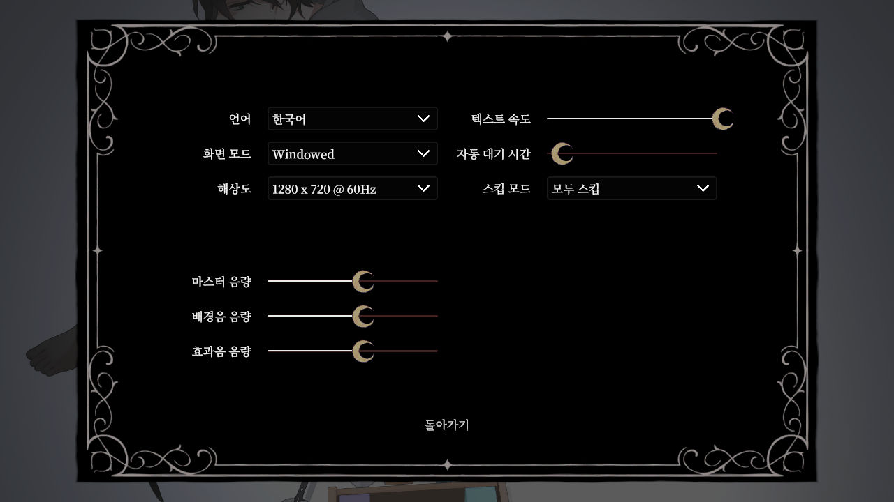
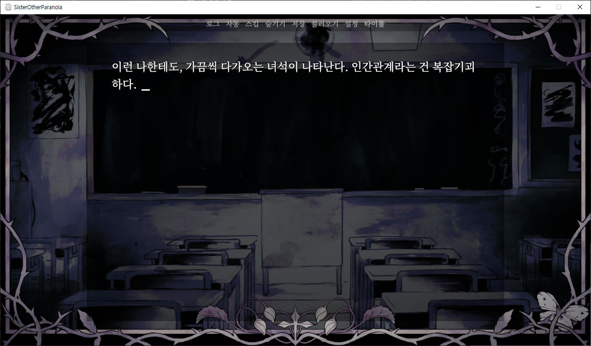

# Sister Other Paranoia 한국어 패치

[Sister Other Paranoia](https://store.steampowered.com/app/4240150) 게임에 한국어 지원을 추가하는 프로그램입니다.  
UI, 이미지, 폰트, 게임 내 대사를 한국어로 변경합니다.

현재 지원하는 게임의 BuildID는 24746532입니다.

CLI, GUI 지원. 인자 없이 실행하면 GUI가 열립니다.  
프로그램을 게임 옆에 놓으면 `SisterOtherParanoia_Data`를 자동으로 찾으며  
GUI에서는 게임 설치 폴더 또는 `SisterOtherParanoia_Data` 폴더를 선택할 수 있습니다.

초벌 번역에는 gemini-3.1-flash-lite, 중간 검수는 gpt-5.6-sol, 최종 검수는 제가 했습니다.  

어색하거나, 오역인 문장의 제보나 기타 문의는 Issue 탭, [개인 사이트](https://doujinkorea.com/)를 통하시면 됩니다.  
자세한 작업 내역이나, 후기도 그쪽에 올리겠습니다.

